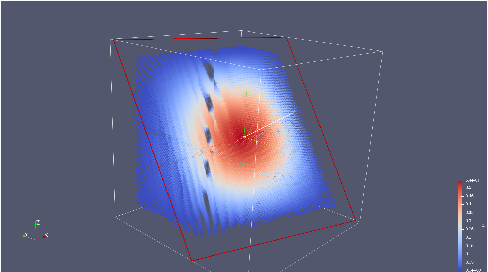
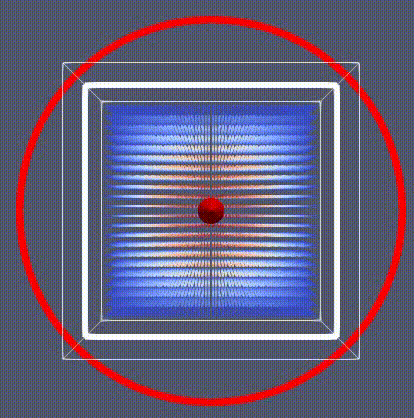
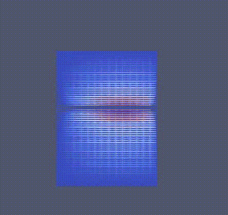

# Competitive Task

## Formulation of the Diffusion Problem
The solution of the non-stationary diffusion equation with unknown U is considered:
```math
U = U(x, y, z, t):
```

```math
∂U/∂t - div (D · grad U) = f(x, y, z, t), (x,y,z)
``` 

where dot $(x, y, z)$ belongs $Ω = [0; 1]^3$, $t$ on the segment $[0, T]$

Boundary conditions:
```math
U(x, y, z, t) = g(x, y, z) 
```
on the boundary of the domain $∂Ω$, and the initial conditions are: 

```math
U(x, y, z, 0) = 0 
```
at the initial time $t_0 = 0$.

Let's set the final moment of time as $T = 1$.


In the problem, we will use the diagonal tensor $D$:

```math
D=\begin{pmatrix}
d_x & 0 & 0 \\
0 & d_y & 0 \\
0 & 0 & d_z 
\end{pmatrix}
```

where $d_x = 0.25, d_y = 0.15, d_z = 0.1$

Initial-boundary conditions:
```math
g(x, y, z) = 0
f(x, y, z) = (d_x+d_y+d_z)·π²·sin(πx)·sin(πy)·sin(πz)
```

The equation being solved has an analytical solution:
```math
U_analityc = sin(πx)·sin(πy)·sin(πz)·(1 - exp(-(d_x+d_y+d_z)·π²·t))
```

## Discretization
Let us construct in our domain $Ω$ a uniform grid consisting of parallelepipeds. 

We choose the numbers $Nx, Ny, Nz > 1$ — the number of nodes that will fit along the axis $Ox$, $Oy$ and $Oz$, respectively.
Then we define the grid step $Δx = \frac{1}{(Nx-1)}, Δy = \frac{1}{(Ny-1)}, Δz = \frac{1}{(Nz-1)}. $
We also define the time step $Δt$.
Denote by $V_{ijk}$ the grid node with coordinates $x_i = i Δx, y_j = j Δy, z_k = k Δz.$

We will describe the discrete function $[U]^h$ at time $nΔt$ by its degrees of freedom, which we will place at the grid nodes
and the degree of freedom at the node $V_{ijk}$ will be denoted as:
```math
U_{ijk}^n, 0 ⩽ i ⩽ Nx-1, 0 ⩽ j ⩽ Ny-1, 0 ⩽ k ⩽ Nz-1.
```
We discretize our equation in space by the finite difference method, and in time by the explicit Euler scheme.

Note that for such a discretization, the time step must satisfy the Courant condition:
```math
Δt < \frac{0.5}{ \frac{d_x } {(Δx)^2} + \frac{d_y}{(Δy)^2} + \frac{d_z}{(Δz)^2} }
```
Let us introduce discrete operators of the second spatial derivatives:

```math
Lx_{ijk} U^n = \frac{ U_{(i-1)jk}^n - 2·U_{ijk}^n + U_{(i+1)jk}^n }{Δx^2}
Ly_{ijk} U^n = \frac{ U_{i(j-1)k}^n - 2·U_{ijk}^n + U_{i(j+1)k}^n }{Δy)^2}
Lz_{ijk} U^n = \frac{ U_{ij(k-1)}^n - 2·U_{ijk}^n + U_{ij(k+1)}^n }{Δz^2}
```
Also let
```math
f_{ijk}^n = f(i·Δx, j·Δy, k·Δz, nΔt)
``` 
and
```math
g_{ijk} = g(i·Δx, j·Δy, k·Δz)
```
Then we have the following numerical scheme:
```math
U_{ijk}^{(n+1)} = U_{ijk}^n + Δt·(f_{ijk}^n + d_x·Lx_{ijk} U^n + d_y·Ly_{ijk} U^n + d_z·Lz_{ijk} U^n) 
```
```math
1 ⩽ i ⩽ Nx-2, 1 ⩽ j ⩽ Ny-2, 1 ⩽ k ⩽ Nz-2
U_{ijk}^{(n+1)} = g_{ijk},
```
if $(i%(Nx-1)) (j%(Ny-1)) (k%(Nz-1)) = 0$, where $x%y$ is the operation of taking the remainder of division $x$ on $y$.

## Start Code

```bash
pip install -r requirements.txt
mkdir build
cd build
cmake ..
make
./main
```

## Analytical Solution
<p align="center">
  
</p>

## Implemented Solution

**Error rate** — 0.00076.

Computing power (cluster) provided by the **Institute of Numerical Mathematics** 
of the **Russian Academy of Sciences**, Moscow.

Time of work with the optimizer:
<div align="center">

| **2 processors** | **32 processors** |
|------------------|-------------------|
| 12.78 s          | 1.1 s             |


</div>


<p align="center">
  
</p>

## Parallel version
A parallel version of the solution was implemented using the MPI package. 
To do this, the discretization area is divided along the $Ox$ axis into the number of processors, 
counting and data transfer between processes is implemented. 


At the end, the results are concatenated into the final solution.

The image below shows the solution when parallelized to 4 processors.
<p align="center">
  
</p>

## Note
> To create images, a Python script was written that generates a .vtk file from the available data. 
These files are further concatenated using the ParaView software. 
The cuts of the resulting cube are also implemented in Paraview.
